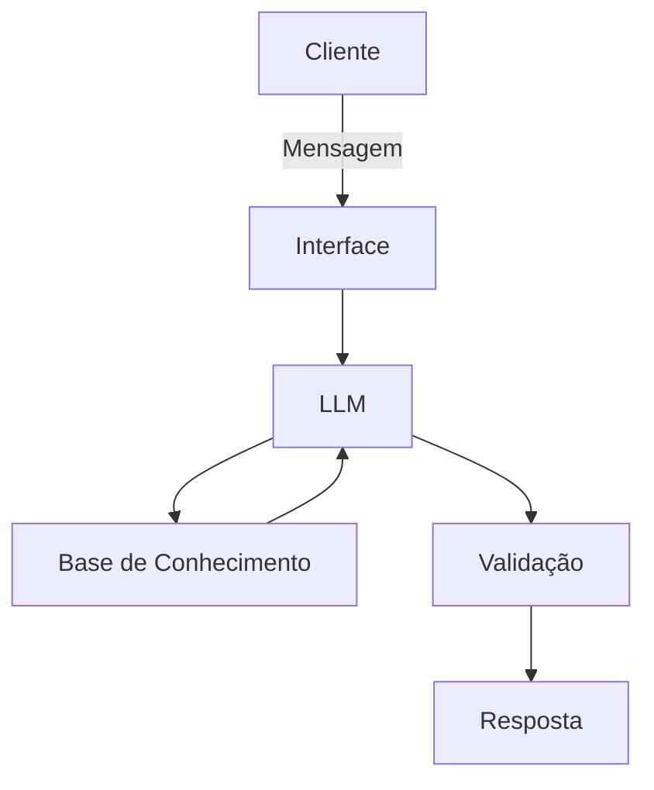

# 🤖 Agente de Busca Inteligente com IA Generativa

## Contexto

Os assistentes virtuais nos diversos setores estão evoluindo de simples chatbots reativos para **agentes inteligentes e proativos**. Neste desafio, você vai idealizar e prototipar um agente de busca da variação de preços que utiliza IA Generativa para:

- **Antecipar necessidades** ao invés de apenas responder perguntas
- **Personalizar** sugestões com base no contexto de cada cliente
- **Cocriar soluções** de forma consultiva
- **Garantir segurança** e confiabilidade nas respostas (anti-alucinação)

> [!TIP]
> Na pasta [`examples/`](./examples/) você encontra referências de implementação para cada etapa deste desafio.

---

## Detalhamento do Projeto

### 1. Documentação do Agente

Definição **o que** o agente faz e **como** ele funciona:

- **Caso de Uso:** As pessoas ficam em dúvida se estão comprando algum produto pelo melhor preço em determinada data, ou se deveriam esperar alguns dias esperando que o produto entre em promoção em breve.
- **Persona e Tom de Voz:** Atua como um consultor que utiliza uma linguagem direta e clara.
- **Arquitetura:**

- **Segurança:** Limitar o escopo fornecendo um contexto, indicando ações permitidas e ações não permitidas.

📄 **Template:** [`docs/01-documentacao-agente.md`](./docs/01-documentacao-agente.md)

---

### 2. Base de Conhecimento

Esse agente utiliza os **dados mockados** disponíveis na pasta [`data/`](./data/) para alimentar seu agente:

| Arquivo | Formato | Descrição |
|---------|---------|-----------|
| `products_price.csv` | CSV | Histórico de preços de produtos |


É possível adaptar ou expandir esses dados conectando o Agente a uma API de serviços que fornece os valores de produtos, porém essa abordagem não foi feita nesse projeto devido aos custos de utilização dessa API.

📄 **Template:** [`docs/02-base-conhecimento.md`](./docs/02-base-conhecimento.md)

---

### 3. Prompts do Agente

Documenta os prompts que definem o comportamento do Agente:

- **System Prompt:** Instruções gerais de comportamento e restrições
- **Exemplos de Interação:** Cenários de uso com entrada e saída esperada
- **Tratamento de Edge Cases:** Como o agente lida com situações limite

📄 **Template:** [`docs/03-prompts.md`](./docs/03-prompts.md)

---

### 4. Aplicação Funcional

Desenvolvido um **protótipo funcional** do Agente:

- Chatbot interativo utilizando Streamlit
- Integração com Ollama executando o modelo gpt-oss da OpenAI em um mini servidor local
- Conexão com a base de conhecimento

📁 **Pasta:** [`src/`](./src/)

---

### 5. Avaliação e Métricas

Sumário da avaliação da qualidade do Agente:

**Métricas Sugeridas:**
- Precisão/assertividade das respostas
- Taxa de respostas seguras (sem alucinações)
- Coerência com o perfil do cliente

📄 **Template:** [`docs/04-metricas.md`](./docs/04-metricas.md)

---

### 6. Pitch

[Agente Faro Fino](https://youtu.be/zdUnhoNDfxk) em ação.

---

## Ferramentas Sugeridas

Todas as ferramentas abaixo possuem versões gratuitas:

| Categoria | Ferramentas |
|-----------|-------------|
| **LLMs** | [ChatGPT](https://chat.openai.com/), [Copilot](https://copilot.microsoft.com/), [Gemini](https://gemini.google.com/), [Claude](https://claude.ai/), [Ollama](https://ollama.ai/) |
| **Desenvolvimento** | [Streamlit](https://streamlit.io/), [Gradio](https://www.gradio.app/), [Google Colab](https://colab.research.google.com/) |
| **Orquestração** | [LangChain](https://www.langchain.com/), [LangFlow](https://www.langflow.org/), [CrewAI](https://www.crewai.com/) |
| **Diagramas** | [Mermaid](https://mermaid.js.org/), [Draw.io](https://app.diagrams.net/), [Excalidraw](https://excalidraw.com/) |

---

## Estrutura do Repositório

```
📁 dio-lab-agent-price-tracking/
│
├── 📄 README.md
│
├── 📁 data/                          # Dados mockados para o agente
│   ├── products_price.csv            # Histórico de preços de produtos (CSV)
│
├── 📁 docs/                          # Documentação do projeto
│   ├── 01-documentacao-agente.md     # Caso de uso e arquitetura
│   ├── 02-base-conhecimento.md       # Estratégia de dados
│   ├── 03-prompts.md                 # Engenharia de prompts
│   ├── 04-metricas.md                # Avaliação e métricas
│   └── 05-pitch.md                   # Roteiro do pitch
│
├── 📁 src/                           # Código da aplicação
│   └── app.py                        # Aplicação usando Streamlit
│   └── requirements.txt              # Lista de dependências do projeto
│   └── README.md                     # Resumo sobre a aplicação
│
├── 📁 assets/                        # Imagens e diagramas
│   └── ...
│
└── 📁 examples/                      # Referências e exemplos
    └── README.md
```

---

## Dicas Finais

1. **Iniciar pelo prompt:** Um bom system prompt é a base de um agente eficaz
2. **Utilizar dados mockados:** Eles garantem consistência e evitam problemas com dados sensíveis
3. **Atenção na segurança:** Evitar alucinações e segurança de dados são pontos crítico
4. **Testar cenários reais:** Simulação de perguntas que um usuário faria de verdade
5. **Pitch deve ser objetividade:** 3 minutos passam rápido


## Comentários

Se você encontrou alguma informação inconsistente ou tenha alguma sugestão, ficaria feliz em receber o feedback.
