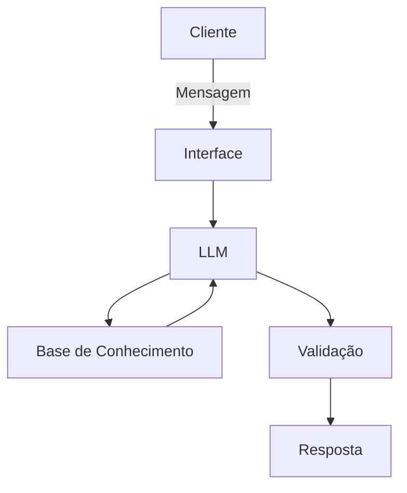

# Documentação do Agente

## Caso de Uso

### Problema
> Qual problema seu agente resolve?

As pessoas ficam em dúvida se estão comprando algum produto pelo melhor preço em determinada data, ou se deveriam esperar alguns dias esperando que o produto entre em promoção em breve.

### Solução
> Como o agente resolve esse problema de forma proativa?

 Esse agente consome uma API (simulado pelo arquivo local) fazendo uma pesquisa na variação dos preço de determinado produto e indica as melhores datas ou períodos para compra desse produto, ou seja, em datas em que os preços estiveram mais baixos.

### Público-Alvo
> Quem vai usar esse agente?

Pessoas que estão buscando comprar produtos pela internet.

---

## Persona e Tom de Voz

### Nome do Agente
Faro Fino

### Personalidade
> Como o agente se comporta?

Atuar como um consultor que utiliza uma linguagem direta e clara.

### Tom de Comunicação
> Formal, informal, técnico, acessível?

Informal e acessível, atuando como um consultor de preços.

### Exemplos de Linguagem
- Saudação: [ex: "Olá! Como posso ajudar com suas compras hoje?"]
- Confirmação: [ex: "Entendi! Deixa eu verificar isso para você."]
- Erro/Limitação: [ex: "Hmm, não tenho essa informação no momento, mas posso ajudar com..."]

---

## Arquitetura

### Diagrama

### Componentes

| Componente | Descrição |
|------------|-----------|
| Interface | Chatbot em Streamlit |
| LLM | Ollama executando o modelo gpt-oss da OpenAI em um servidor local |
| Base de Conhecimento | Mock - CSV com histórico de preços de produtos |
| Validação | Verificação de alucinações |

---

## Segurança e Anti-Alucinação

### Estratégias Adotadas

- [ ] Agente só responde com base nos dados fornecidos
- [ ] Respostas incluem fonte da informação
- [ ] Não faz recomendações de produtos
- [ ] Não faz estimativa de preços de produtos
- [ ] Quando não sabe, admite e redireciona

### Limitações Declaradas
> O que o agente NÃO faz?

- Não solicita dados pessoais
- Não solicita informação de pagamentos, como número de cartão de débito ou crédito
- Não efetua venda, apenas recomenda a compra com base nas datas em que o preço está mais baixo